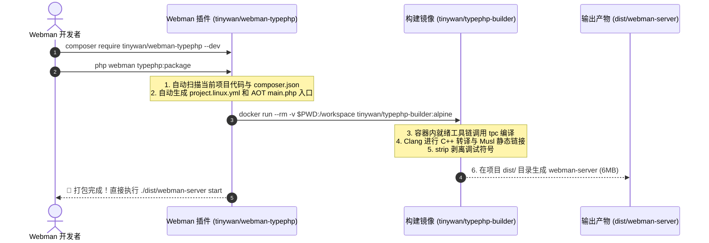

# Webman TypePHP AOT 静态编译打包插件与 Docker 构建方案

> **项目名称**：`tinywan/webman-typephp`  
> **配套镜像**：`tinywan/typephp-builder:alpine`  
> **开源定位**：Webman 官方标准基础插件 + AOT 原生二进制构建环境 (Architecture RFC)

## 1. 痛点与破局

### 1.1 现状痛点
1. **心智负担高**：普通 Webman 开发者无法手动在本地配置一套完整的 C++17、Clang、Musl-libc、PHP 8.5 Embed、Swoole PHPX 以及 GMP/MPFR 静态编译链路。
2. **代码依赖配置繁琐**：不同用户的业务引入了不同的 Composer 包，手动编写 `project.linux.yml` 和 AOT 引导入口 `main.php` 门槛极高。

### 1.2 破局架构：双子星方案
- **前端门面（Webman 基础插件）**：`tinywan/webman-typephp`  
  负责在宿主机扫描项目代码依赖、自动生成 AOT `main.php` 和 `project.linux.yml`，提供极简命令行。
- **后端引擎（构建 Docker 镜像）**：`tinywan/typephp-builder:alpine`  
  作为自包含的黑盒编译器，内置完整 Alpine + Clang + PHP 8.5 + Musl 纯静态 SDK，屏蔽所有环境差异。

## 2. 整体协同工作流



## 3. Webman 插件端设计 (`tinywan/webman-typephp`)

严格按照 [Webman 基础插件创建流程](https://www.workerman.net/doc/webman/plugin/create.html) 与标杆插件 `Tinywan/webman-storage` 规范开发。

### 3.1 目录结构
```text
tinywan/webman-typephp/
├── .github/
│   └── workflows/
│       └── docker-publish.yml      # Docker 镜像自动构建与发布
├── docker/
│   ├── Dockerfile                  # 构建镜像 Dockerfile
│   └── entrypoint.sh               # 容器内自动化编译调度脚本
├── src/
│   ├── Commands/
│   │   ├── PackageCommand.php      # php webman typephp:package (打包构建)
│   │   ├── DoctorCommand.php       # php webman typephp:doctor (环境自检)
│   │   └── InitCiCommand.php       # php webman typephp:init-ci (生成 GitHub Action)
│   ├── Compiler/
│   │   └── ProjectGenerator.php    # 自动分析项目依赖并生成 project.linux.yml
│   ├── Stubs/
│   │   └── main.php.stub           # AOT 核心启动引导模板
│   ├── config/plugin/tinywan/typephp/
│   │   ├── app.php                 # 插件配置（Docker 镜像名、忽略目录等）
│   │   └── command.php             # Webman 控制台命令注册
│   └── Install.php                 # Webman 插件安装与卸载生命周期钩子
├── composer.json
└── README.md
```

### 3.2 规范约束与生命周期
1. **严格类型与标准注释**：所有 PHP 源文件必须在头部包含 `declare(strict_types=1);` 以及标准作者 DocBlock。
2. **环境版本要求**：PHP 版本严格约束为 `>=8.5`，开发依赖声明 `"require-dev": {"swoole/typephp": "*"}`。
3. **插件安装器声明**：`Install::WEBMAN_PLUGIN = true`，自动映射与卸载配置文件。

### 3.3 核心命令矩阵
- **`php webman typephp:package`**（默认）：  
  自动检查本地 Docker 环境，挂载当前项目，秒级输出全静态单文件 `dist/webman-server`。
- **`php webman typephp:doctor`**：  
  自检本地环境（PHP 8.5+、Docker 状态、Clang 编译器等），给出优化指引。
- **`php webman typephp:init-ci`**：  
  在 `.github/workflows/` 生成自动化构建流水线，打 Tag 即可自动在 GitHub Releases 发布跨平台包。

## 4. Docker 构建镜像设计 (`tinywan/typephp-builder`)

### 4.1 Dockerfile
```dockerfile
FROM alpine:edge

LABEL maintainer="Tinywan <756684177@qq.com>"
LABEL description="TypePHP AOT Static Compiler & Packager Environment for Webman"

# 1. 安装基础编译工具链与 PHP 8.5 运行时
RUN apk add --no-cache bash clang lld build-base binutils \
    pcre2-dev php85 php85-phar php85-openssl php85-tokenizer \
    php85-ctype php85-mbstring php85-dom php85-xml \
    php85-simplexml php85-pcntl php85-posix \
    && ln -sf /usr/bin/php85 /usr/bin/php

# 2. 预置我们在本项目中验证通过的 Musl 全静态 SDK 与 GMP 兼容存根
COPY sdk /opt/typephp-sdk

# 3. 预置入口脚本
COPY entrypoint.sh /entrypoint.sh
RUN chmod +x /entrypoint.sh

WORKDIR /workspace
ENTRYPOINT ["/entrypoint.sh"]
```

### 4.2 容器入口调度 `entrypoint.sh`
```bash
#!/usr/bin/env bash
set -e

echo "=========================================================="
echo " [TypePHP Builder] Starting AOT Compilation Pipeline"
echo "=========================================================="

WORKSPACE_DIR="/workspace"
cd "$WORKSPACE_DIR"

# 1. 检查 project.linux.yml
if [ ! -f "project.linux.yml" ]; then
    echo "[ERROR] project.linux.yml not found in workspace!"
    exit 1
fi

# 2. 解析 PHP 与 TPC 编译器
PHP_BIN=$(command -v php85 || command -v php)
if [ -f "./vendor/bin/tpc.php" ]; then
    TPC_BIN="./vendor/bin/tpc.php"
elif command -v tpc &> /dev/null; then
    TPC_BIN="tpc"
else
    echo "[ERROR] tpc compiler not found! Please ensure swoole/typephp is installed in composer."
    exit 1
fi

# 3. 执行全静态编译
echo "[INFO] Running TPC AOT compilation in Musl full-static mode..."
$PHP_BIN $TPC_BIN project.linux.yml --full-static --compiler=clang

# 4. 组装自包含 dist/ 目录
echo "[INFO] Assembling self-contained dist/ directory..."
rm -rf dist
mkdir -p dist

if [ -f "build/webman-server" ]; then
    cp -f "build/webman-server" "dist/webman-server"
    chmod +x "dist/webman-server"
elif [ -f "build/webman_server" ]; then
    cp -f "build/webman_server" "dist/webman-server"
    chmod +x "dist/webman-server"
else
    echo "[ERROR] Compiled binary not found in build/!"
    exit 1
fi

# 拷贝静态资源与配置文件
[ -d config ] && cp -r config dist/
[ -d public ] && cp -r public dist/
if [ -d app/view ]; then
    mkdir -p dist/app
    cp -r app/view dist/app/
fi

# 5. 剥离调试符号瘦身
if command -v strip &> /dev/null; then
    echo "[INFO] Stripping debug symbols to minimize binary size..."
    strip --strip-all dist/webman-server 2>/dev/null || true
fi

echo "=========================================================="
echo " [SUCCESS] Build completed! Binary: dist/webman-server"
echo " File size: $(ls -lh dist/webman-server | awk '{print $5}')"
echo "=========================================================="
```

## 5. 开发者极致体验 (User Journey)

任何安装了 Webman 的项目，只需以下三步：

```bash
# 步骤 1：引入插件
composer require tinywan/webman-typephp --dev

# 步骤 2：一键编译打包（依赖本地 Docker，零环境配置）
php webman typephp:package

# 步骤 3：在任意 Linux 服务器直接运行
cd dist
./webman-server start -d
```

## 6. 开源与发布推进路线

1. **构建并推送 Docker 镜像**：
   将已验证的 Musl SDK 封装进 Dockerfile，推送至 Docker Hub：`tinywan/typephp-builder:alpine`。
2. **规范化插件仓库**：
   在 `tinywan/webman-typephp` 中对齐 `webman-storage` 规范（声明严格类型、生命周期安装器、PHP 8.5 约束）。
3. **发布 Packagist**：
   在 Packagist 提交插件，支持用户执行 `composer require tinywan/webman-typephp --dev`。
4. **入驻 Webman 官方插件市场**：
   在 [Workerman 官方社区](https://www.workerman.net/app) 申请上架，成为官方推荐的 Webman AOT 原生二进制构建工具！
