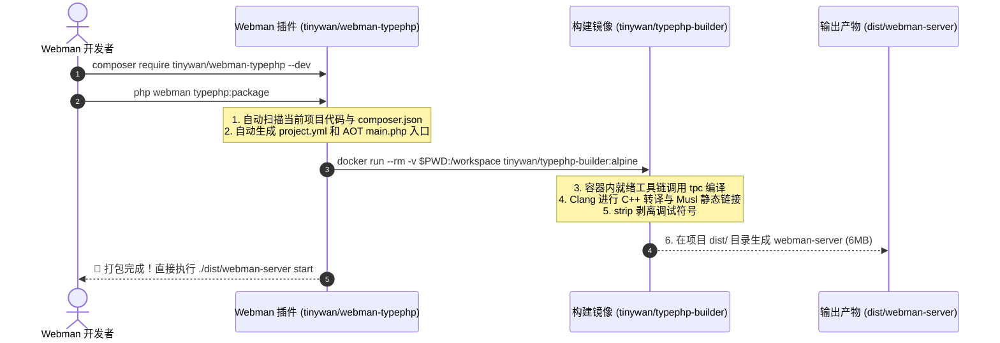

# Webman TypePHP AOT 静态编译打包插件与 Docker 构建方案

> **项目代号**：`tinywan/webman-typephp`  
> **配套镜像**：`tinywan/typephp-builder:alpine`  
> **文档定位**：架构设计与开源落地实施方案 (Architecture RFC)

---

## 1. 痛点与破局

### 1.1 现状痛点
1. **心智负担高**：普通 Webman 开发者无法手动在本地配置一套完整的 C++17、Clang、Musl-libc、PHP 8.5 Embed、Swoole PHPX 以及 GMP/MPFR 静态编译链路。
2. **代码依赖配置繁琐**：不同用户的业务引入了不同的 Composer 包，手动编写 `project.linux.yml` 和 AOT 引导入口 `main.php` 门槛极高。

### 1.2 破局架构：双子星方案
- **前端门面（Webman 基础插件）**：`tinywan/webman-typephp`
  负责在宿主机扫描项目代码依赖、自动生成 AOT `main.php` 和 `project.yml`，提供极简命令行。
- **后端引擎（构建 Docker 镜像）**：`tinywan/typephp-builder:alpine`
  作为自包含的黑盒编译器，内置完整 Alpine + Clang + PHP 8.5 + Musl 纯静态 SDK，屏蔽所有环境差异。

---

## 2. 整体协同工作流



---

## 3. Webman 插件端设计 (`tinywan/webman-typephp`)

按照 [Webman 基础插件创建流程](https://www.workerman.net/doc/webman/plugin/create.html) 开发。

### 3.1 目录结构
```text
tinywan/webman-typephp/
├── src/
│   ├── Commands/
│   │   ├── PackageCommand.php      # php webman typephp:package
│   │   ├── DoctorCommand.php       # php webman typephp:doctor (自检)
│   │   └── InitCiCommand.php       # php webman typephp:init-ci (一键生成 GitHub Action)
│   ├── Compiler/
│   │   ├── ProjectGenerator.php    # 自动扫描依赖并生成 project.yml
│   │   └── EntrypointBuilder.php   # 生成适配 AOT 运行的 main.php
│   └── Stubs/
│       ├── main.php.stub           # AOT 核心启动引导模板
│       └── build.yml.stub          # GitHub Actions 模版
├── config/plugin/tinywan/typephp/
│   └── app.php                     # 插件配置（Docker 镜像名、忽略目录等）
├── composer.json
└── README.md
```

### 3.2 核心命令设计
- **`php webman typephp:package`**（默认）：
  检查本地 Docker 环境，挂载当前项目，秒级输出全静态单文件 `dist/webman-server`。
- **`php webman typephp:package --dynamic`**：
  打包为带有独立 `.so` 和 `start.sh` 的动态链接发布包。
- **`php webman typephp:doctor`**：
  诊断本地环境（PHP 版本、Docker 状态、Clang/MSVC 工具链）。
- **`php webman typephp:init-ci`**：
  在 `.github/workflows/` 生成自动化构建流水线，打 Tag 即可自动在 GitHub Releases 发布跨平台包。

---

## 4. Docker 构建镜像设计 (`tinywan/typephp-builder`)

### 4.1 Dockerfile
```dockerfile
FROM alpine:edge

# 1. 安装基础编译工具链与 PHP 8.5 运行时
RUN apk add --no-cache bash clang lld build-base binutils \
    pcre2-dev php85 php85-phar php85-openssl php85-tokenizer \
    php85-ctype php85-mbstring php85-dom php85-xml \
    php85-simplexml php85-pcntl php85-posix \
    && ln -sf /usr/bin/php85 /usr/bin/php

# 2. 预置我们在本项目中验证通过的 Musl 全静态 SDK 与 GMP 兼容存根
COPY sdk /opt/typephp-sdk

# 3. 预置入口脚本
COPY entrypoint.sh /entrypoint.sh
RUN chmod +x /entrypoint.sh

WORKDIR /workspace
ENTRYPOINT ["/entrypoint.sh"]
```

### 4.2 容器入口调度 `entrypoint.sh`
```bash
#!/usr/bin/env bash
set -e

echo "[Builder] Starting TypePHP AOT build process..."

# 确保 SDK 环境与软链接
export PHPX_HOME="/opt/typephp-sdk"
PHP_BIN=$(command -v php || command -v php85)

# 调用项目中的 tpc 或容器内预装 tpc
TPC_BIN="./vendor/bin/tpc.php"
[ ! -f "$TPC_BIN" ] && TPC_BIN="tpc"

# 执行编译
$PHP_BIN $TPC_BIN project.linux.yml --full-static --compiler=clang

# 组装 dist 目录
mkdir -p dist
cp -f build/webman-server dist/webman-server
chmod +x dist/webman-server
[ -d config ] && cp -r config dist/
[ -d public ] && cp -r public dist/
[ -d app/view ] && mkdir -p dist/app && cp -r app/view dist/app/

# 剥离符号以最小化体积
strip --strip-all dist/webman-server

echo "[Builder] Successfully built dist/webman-server!"
```

---

## 5. 开发者极致体验 (User Journey)

任何安装了 Webman 的项目，只需以下三步：

```bash
# 步骤 1：引入插件
composer require tinywan/webman-typephp --dev

# 步骤 2：一键编译打包（依赖本地 Docker，零环境配置）
php webman typephp:package

# 步骤 3：在任意 Linux 服务器直接运行
cd dist
./webman-server start -d
```

---

## 6. 开源与发布推进路线

1. **Step 1：构建并推送 Docker 镜像**：
   将当前项目验证完毕的 Musl SDK 封装进 Dockerfile，推送至 Docker Hub：`tinywan/typephp-builder:alpine`。
2. **Step 2：创建独立插件仓库**：
   创建 `tinywan/webman-typephp` 代码库，实现基础插件与 Console Command。
3. **Step 3：发布 Packagist**：
   在 Packagist 提交插件，支持 `composer require tinywan/webman-typephp`。
4. **Step 4：入驻 Webman 官方插件市场**：
   在 [Workerman 官方社区](https://www.workerman.net/app) 申请上架，成为官方推荐的 Webman AOT 原生二进制构建工具！
