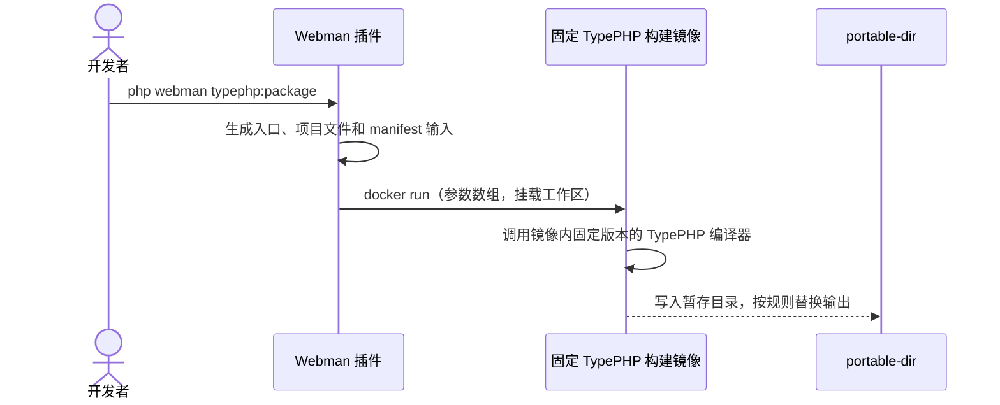

# Webman TypePHP 构建插件方案（架构 RFC）

**状态：** 第一阶段技术预览方案

**包名：** `tinywan/webman-typephp`

**第一阶段目标：** Linux x86_64 portable-dir（可移植目录）

## 1. 决策与范围

插件与构建镜像分工明确：插件负责读取项目配置、生成受约束的 TypePHP
输入并编排 Docker；构建镜像负责提供固定版本的 TypePHP 编译工具链。插件不
依赖宿主项目 `require-dev` 中是否安装 TypePHP。

第一阶段只验证一条范围明确、可检查的链路：兼容当前 TypePHP 版本和扩展要求的
Webman 项目，在 Linux x86_64 上生成 portable-dir 技术预览产物。第一阶段不承诺
任意 Webman 项目、任意动态 PHP 代码或完整 Composer 运行时发现。

下列内容均不属于第一阶段承诺：全静态链接、单文件交付、6 MB 体积、零运行时依赖、
跨平台运行，以及对所有动态特性的兼容。

## 2. 第一阶段契约

输入包括：受支持的 Webman 项目、Docker、显式的 `sources`/`ignore` 配置，以及
符合所选 TypePHP 版本和扩展要求的应用代码。

默认输出目录如下：

```text
dist/
├── webman-server
├── build-manifest.json
├── config/                 # 存在时复制
├── public/                 # 存在时复制
└── app/view/               # 存在时复制
```

这是“二进制加运行时资源”的可移植目录，不是单一文件。`build-manifest.json`
至少记录构建镜像引用、TypePHP/工具链信息、生成器输入、输出设置和输入摘要，
使构建结果可以追溯。

第一阶段只覆盖明确列出的 Webman 运行时入口和项目输入，不保证反射、运行时
`require`、动态类名或动态路由、未列出的 Composer 包及未列出的 PHP 扩展。

## 3. 架构与构建流程



插件负责项目输入生成、参数校验、Docker 编排、产物组装和 manifest；镜像负责
编译器、PHP/PHPX、原生库及其版本固定。构建过程应在 `.typephp/` 下暂存，默认
拒绝覆盖已有输出，只有显式传入 `--force` 才允许替换。用户输入不得拼接进 shell
命令，Docker 参数必须按独立参数传递。

## 4. 构建镜像政策

镜像应固定 TypePHP 版本及构建参数，不从挂载项目中查找
`vendor/bin/tpc.php`。发布 CI 应使用不可变镜像摘要，并记录 TypePHP revision、
PHP/PHPX/原生库版本、基础镜像摘要、许可证声明和校验和。

第一阶段只使用已确认的编译器调用约定，不公开未经验证的 `--full-static`、
`--dynamic` 或编译器选择参数。任何静态链接、体积或部署兼容性结论，都必须有
可复现的构建和运行验证支持。

## 5. 命令与安全边界

- `php webman typephp:doctor`：检查 PHP 和 Docker 前置条件；Docker 不可用时，
  第一阶段构建链路应判定为失败。宿主机不要求安装 Clang。
- `php webman typephp:package [--image=REFERENCE] [--force]`：使用指定或默认
  构建镜像生成 Linux x86_64 portable-dir。镜像引用必须校验，并作为一个 Docker
  参数传递。
- `php webman typephp:init-ci`：生成 Linux x86_64 portable-dir 的 CI 工作流。

构建不得无条件删除项目已有的 `dist/`；不得将未校验的镜像引用、路径或其他用户
输入插入 shell；输出目录存在时必须遵守覆盖保护。构建日志和 manifest 不得泄露
密钥、令牌等敏感配置。

## 6. 第一阶段验收标准

1. 使用发布的固定镜像，从一个已知兼容 fixture 完成构建。
2. 在 Linux x86_64 启动产物，完成 HTTP 冒烟请求，并能正常停止。
3. 检查 portable-dir 内容和 `build-manifest.json`，确认工具链与输入可追溯。
4. 覆盖配置、路径、镜像参数和已有输出保护等边界行为。
5. 使用 Pest 编写测试，并遵循 Mago 格式化、lint 和 analyze 约定。

Composer 脚本约定如下；当前环境依赖未安装时，不将这些命令描述为已经跑通：

```json
{
  "format:check": "mago format --check",
  "format": "mago format",
  "lint": "mago lint",
  "analyze": "mago analyze",
  "test": "pest",
  "check": ["@format:check", "@lint", "@analyze", "@test"]
}
```

数据库测试安全底线：测试、脚本和测试框架禁止连接生产、真实业务或共享数据库；
优先使用一次性隔离的 SQLite `:memory:`。执行测试、Schema DDL、迁移或查询前，
必须确认驱动、主机和数据库名属于隔离测试环境；无法确认时必须中止。禁止绕过
框架统一测试连接，也禁止对真实或共享数据库执行删除、清空、迁移刷新或其他破坏
性操作。

## 7. 第二阶段路线（已纳入规划，非第一阶段范围）

在扩大兼容性承诺前，第二阶段必须交付：

1. 分析 Composer `installed.php` 和 classmap，生成可审查的 include/exclude 依赖报告。
2. TypePHP 兼容性预检，以及按项目维护的覆盖配置，让不兼容项可见、可处理。
3. 扩展支持矩阵和对应 fixtures，覆盖已声明支持的 Webman 功能与扩展组合。
4. ARM64 构建器和测试覆盖。
5. 以编译器版本、源码输入 hash、配置 hash 为键的增量构建缓存。

全静态构建、资源嵌入和单文件二进制、更多 Linux 兼容性、Windows/macOS 等平台、
体积目标和 scratch 容器部署，属于第二阶段之后的更后续阶段。每项能力都必须在
可复现构建、兼容性矩阵和实际部署测试完成后，才能转化为对外承诺。
